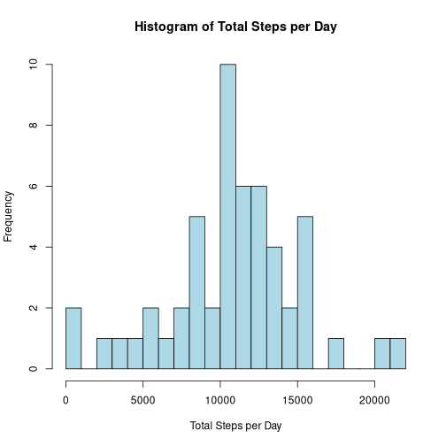
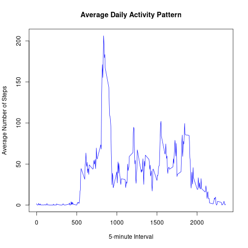
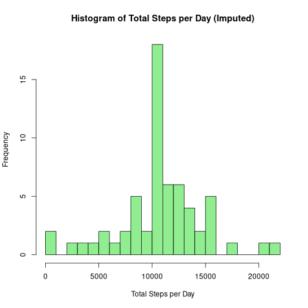
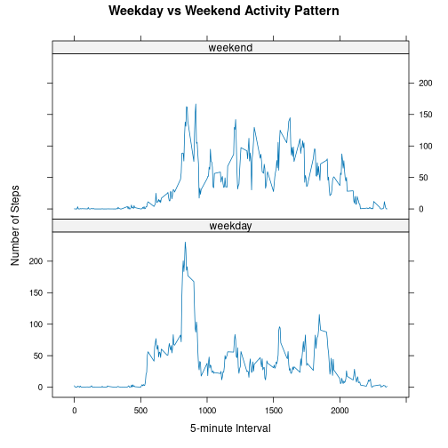

## Loading and Preprocessing the Data


``` r
data <- read.csv("activity.csv")
data$date <- as.Date(data$date)
```

## What is mean total number of steps taken per day?


``` r
daily_steps <- aggregate(steps ~ date, data, sum, na.rm = TRUE)
```


``` r
hist(daily_steps$steps,
     main = "Histogram of Total Steps per Day",
     xlab = "Total Steps per Day",
     col = "lightblue",
     breaks = 20)
```




``` r
mean_steps <- mean(daily_steps$steps)
median_steps <- median(daily_steps$steps)

mean_steps
```

```
## [1] 10766.19
```

``` r
median_steps
```

```
## [1] 10765
```

The mean total number of steps per day is 1.0766189 &times; 10<sup>4</sup>.  
The median total number of steps per day is 10765.

---

## What is the average daily activity pattern?


``` r
interval_avg <- aggregate(steps ~ interval, data, mean, na.rm = TRUE)
```


``` r
plot(interval_avg$interval,
     interval_avg$steps,
     type = "l",
     col = "blue",
     xlab = "5-minute Interval",
     ylab = "Average Number of Steps",
     main = "Average Daily Activity Pattern")
```




``` r
max_interval <- interval_avg[which.max(interval_avg$steps), ]
max_interval
```

```
##     interval    steps
## 104      835 206.1698
```

The 5-minute interval with the maximum average number of steps is 835.

---

## Imputing Missing Values


``` r
total_missing <- sum(is.na(data$steps))
total_missing
```

```
## [1] 2304
```

There are 2304 missing values in the dataset.

### Replace missing values with interval mean


``` r
data_imputed <- data

for (i in 1:nrow(data_imputed)) {
  if (is.na(data_imputed$steps[i])) {
    interval_value <- data_imputed$interval[i]
    replacement <- interval_avg$steps[interval_avg$interval == interval_value]
    data_imputed$steps[i] <- replacement
  }
}
```

---


``` r
daily_steps_imputed <- aggregate(steps ~ date, data_imputed, sum)
```


``` r
hist(daily_steps_imputed$steps,
     main = "Histogram of Total Steps per Day (Imputed)",
     xlab = "Total Steps per Day",
     col = "lightgreen",
     breaks = 20)
```




``` r
mean_imputed <- mean(daily_steps_imputed$steps)
median_imputed <- median(daily_steps_imputed$steps)

mean_imputed
```

```
## [1] 10766.19
```

``` r
median_imputed
```

```
## [1] 10766.19
```

The new mean is 1.0766189 &times; 10<sup>4</sup>.  
The new median is 1.0766189 &times; 10<sup>4</sup>.

---

## Differences Between Weekdays and Weekends


``` r
data_imputed$day_type <- ifelse(weekdays(data_imputed$date) %in% c("Saturday", "Sunday"),
                                "weekend",
                                "weekday")

data_imputed$day_type <- as.factor(data_imputed$day_type)
```


``` r
library(lattice)

interval_daytype <- aggregate(steps ~ interval + day_type,
                              data_imputed,
                              mean)

xyplot(steps ~ interval | day_type,
       data = interval_daytype,
       type = "l",
       layout = c(1, 2),
       xlab = "5-minute Interval",
       ylab = "Number of Steps",
       main = "Weekday vs Weekend Activity Pattern")
```


